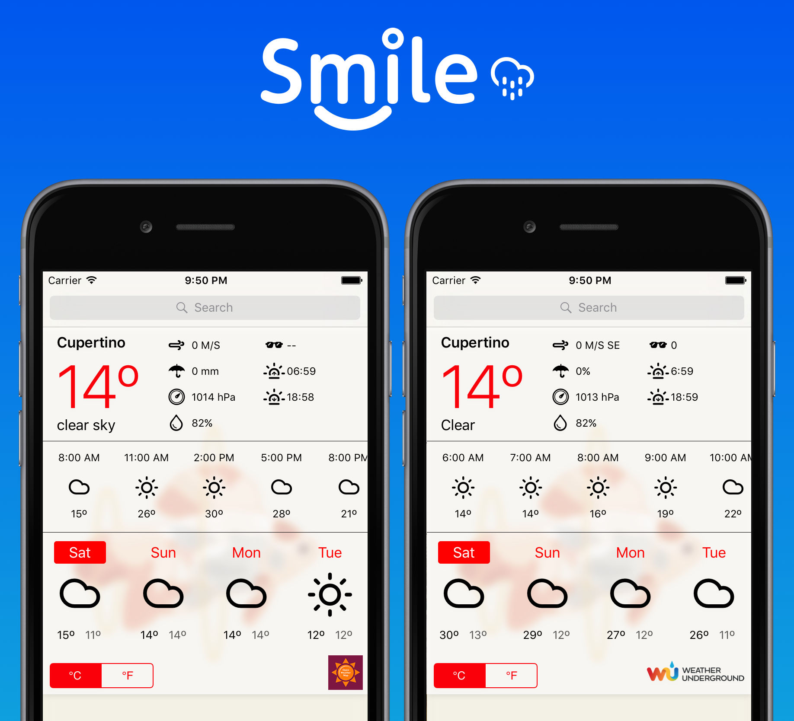
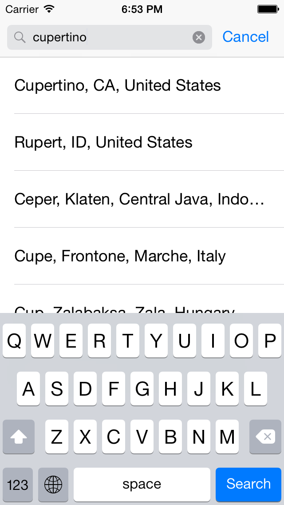
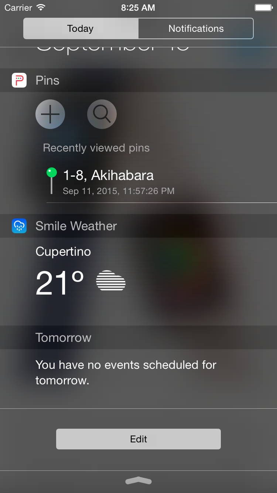

# SmileWeather

[](https://github.com/liu044100/SmileWeather/issues)
[](http://cocoadocs.org/docsets/SmileWeather)
[](http://cocoadocs.org/docsets/SmileWeather)
[](http://cocoadocs.org/docsets/SmileWeather)

A library for Search & Parse the weather data from [Wunderground](http://www.wunderground.com) & [Openweathermap](http://openweathermap.org) conveniently.



#What can it do for you?


##### 1. Handle all complicated things about Search & Parse the weather data.

For example, you can search place by using `-(void)getPlacemarksFromString:(NSString*)string completion:(SmileWeatherPlacemarksCompletion)completion`, the completion block return array of the `CLPlacemark`.

```Objective-c
[[SmileWeatherDownLoader sharedDownloader] getPlacemarksFromString:@"cupertino" completion:^(NSArray *placeMarks, NSError *error) {
        if (!error) {
            //search results: array of placemark in here
        }
    }];
```


You can get the placemark's weather data by using `-(void)getWeatherDataFromPlacemark:(CLPlacemark*)placeMark completion:(SmileWeatherDataDownloadCompletion)completion;`, the completion block return well formed weather data [SmileWeatherData](http://cocoadocs.org/docsets/SmileWeather/0.0.4/Classes/SmileWeatherData.html).

```Objective-c
[[SmileWeatherDownLoader sharedDownloader] getWeatherDataFromPlacemark:placemark completion:^(SmileWeatherData *data, NSError *error) {
        if (!error) {
            //Well formed weather data in here.
        }
    }];
```


##### 2. Need not any weather icon, SmileWeather handle it for you. 

By using [climacons font](http://adamwhitcroft.com/climacons/), the [SmileWeatherData](http://cocoadocs.org/docsets/SmileWeather/0.0.4/Classes/SmileWeatherData.html) contains the corresponding character that is used for weather icon.

```Objective-c
SmileWeatherData *data = ...;
UILabel *iconLabel = ...;

//current weather condition
iconLabel.text = data.currentData.icon;
```


##### 3. Fully localized the related information for almost all the countries in the world.

The weather information, timestamp, weekday, timezone, etc, localized all the related information as much as possible.


##### 4. Add the Weather Widget Style UI to your project simply, by using `SmileWeatherDemoVC`.

Please check the [example project](https://github.com/liu044100/SmileWeather/tree/master/SmileWeather-Example) for more detail. 

```Objective-c
SmileWeatherDemoVC *demoVC = [SmileWeatherDemoVC DemoVCToView:self.containerView];
```


#Theoretical Introduction

The main class is the [SmileWeatherDownLoader](http://cocoadocs.org/docsets/SmileWeather/0.0.4/Classes/SmileWeatherDownLoader.html). It handle downloading weather data from the [Wunderground](http://www.wunderground.com) server. It has three main method:

```Objective-c
/*!Get weather data from CLPlacemark.*/
-(void)getWeatherDataFromPlacemark:(CLPlacemark*)placeMark completion:(SmileWeatherDataDownloadCompletion)completion;

/*!Get weather data from CLLocation.*/
-(void)getWeatherDataFromLocation:(CLLocation*)location completion:(SmileWeatherDataDownloadCompletion)completion;

/*!Get array of CLPlacemark from the input string.*/
-(void)getPlacemarksFromString:(NSString*)string completion:(SmileWeatherPlacemarksCompletion)completion;
```

In the `SmileWeatherDataDownloadCompletion` block, [SmileWeatherData](http://cocoadocs.org/docsets/SmileWeather/0.0.9/Classes/SmileWeatherData.html) is returned, it contains the current weather data, 4 days forecast data, 24 hourly forecast data, etc. 

```Objective-c
[[SmileWeatherDownLoader sharedDownloader] getWeatherDataFromPlacemark:placemark completion:^(SmileWeatherData *data, NSError *error) {
        if (!error) {
            NSLog(@"Current Temperature, Celsius : %@, Fahrenheit: %@", data.currentData.currentTempStri_Celsius, data.currentData.currentTempStri_Fahrenheit);
        }
    }];
```

[SmileWeatherData](http://cocoadocs.org/docsets/SmileWeather/0.0.4/Classes/SmileWeatherData.html) also conform to `NSCoding`, you can archive it as `NSData`.

```Objective-c
SmileWeatherData *data = ...
NSData* encodedData = [NSKeyedArchiver archivedDataWithRootObject: data];
```

#How to use it for your project?

**Step 1.** SmileWeather is available through use [CocoaPods](http://cocoapods.org). To install
it, simply add the following line to your Podfile:

```Ruby
pod 'SmileWeather'

```
Or you can drag the `SmileWeather` fold to your project.

**Step 2.** Sign up [Wunderground](http://www.wunderground.com/weather/api) or [Openweathermap](http://openweathermap.org/api) to get the api key.

**Step 3.** Follow as the below image, add the api key and [climacons font](http://adamwhitcroft.com/climacons/) to your project's `Info.plist`. 


If you use [Wunderground](http://www.wunderground.com/weather/api) api, please add this key: `API_KEY_wunderground` .

If you use [Openweathermap](http://openweathermap.org/api) api, please add this key: `API_KEY_openweathermap`.

If you add both of these in `Info.plist`, please add `API_NOW` to let the `SmileWeather` know which one should be used, `0` is `API_KEY_wunderground`, and `1` is `API_KEY_openweathermap`.


**Step 4.** The last step is that import `SmileWeatherDownLoader.h` to your project, and use it :)

# Support Today Extension

For use `SmileWeather` in Today Extension, add below line to your `Podfile`.

```Ruby
post_install do |installer|
    # NOTE: If you are using a CocoaPods version prior to 0.38, replace `pods_project` with `project` on the below line
    installer.project.targets.each do |target|
        if target.name.end_with? "SmileWeather"
            target.build_configurations.each do |build_configuration|
                if build_configuration.build_settings['APPLICATION_EXTENSION_API_ONLY'] == 'YES'
                    build_configuration.build_settings['GCC_PREPROCESSOR_DEFINITIONS'] = ['$(inherited)', 'SmileWeather_APP_EXTENSIONS=1']
                end
            end
        end
    end
end

```


# Contributions

* Warmly welcome to submit a pull request.

# Contact

* If you have some advice or find some issue, please contact me.
* Email [me](liu044100@gmail.com)

# Thanks

Thanks for Comyar Zaheri's [Sol° for iOS](https://github.com/comyarzaheri/Sol), I am inspired by this project.

Thanks for [climacons font](http://adamwhitcroft.com/climacons/).

# License

SmileWeather is available under the MIT license. See the LICENSE file for more info.
